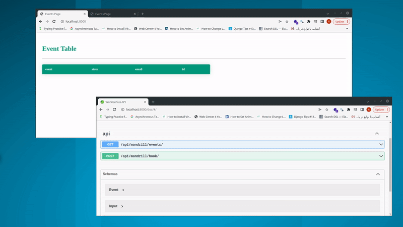
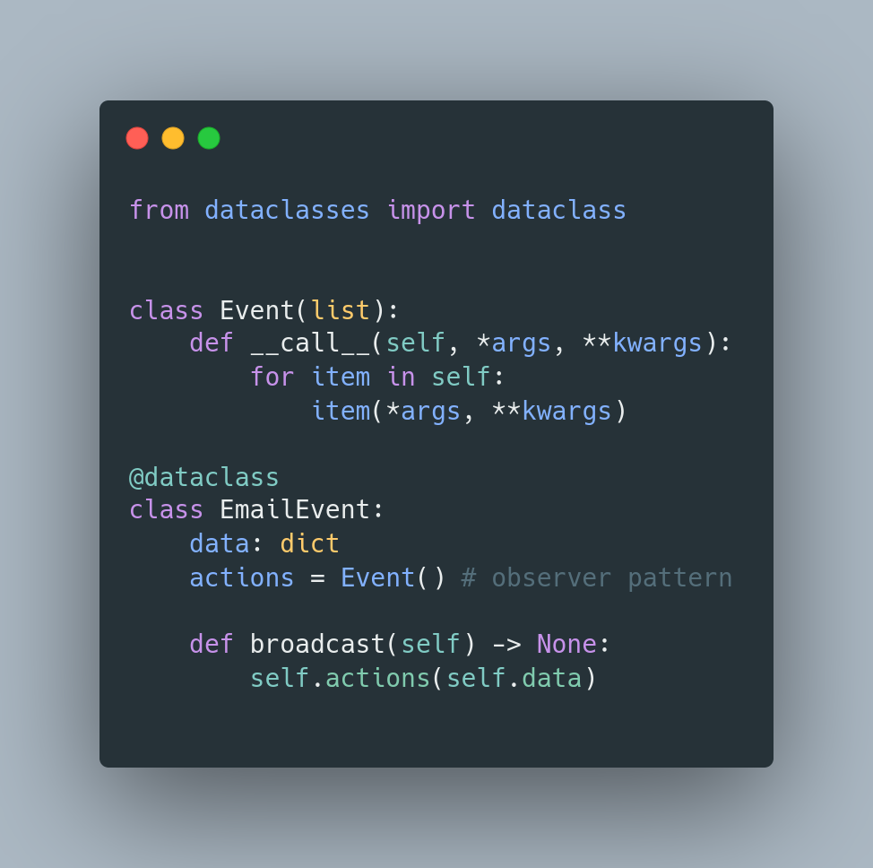

<h1 align="center">
  <br>
  <a href="https://mandrillapp.com/"></a>
  <br>
  Mandrill
  <br>
</h1>

<h4 align="center">A minimal WebSocket Application that can handel <a href="https://mandrillapp.com/" target="_blank">Mandrill</a> Events.</h4>

<p align="center">
  <a href="https://github.com/amirbahador-hub/Mandrill-Django-Channels/actions/workflows/tests.yml/badge.svg">
    
  </a>
</p>

<p align="center">
  <a href="#project-setup">Project Setup</a> •
  <a href="#endpoints">EndPoints</a> •
  <a href="#architecture">Architecture</a> •
  <a href="#libraries">Libraries</a> •
  <a href="#future-improvements">Future Improvements</a>
</p>


## Project Setup


1. SetUp venv

    ```bash
    virtualenv venv
    source venv/bin/activate
    ```

2. install Dependencies
    ```bash
    pip install -r requirements.txt
    ```

3. spin off docker compose
    ```bash
    docker-compose -f docker-compose.dev.yml up -d
    ```

4. create your env
    ```bash
    cp .env.example .env
    ```

5. Create tables
    ```bash
    python manage.py migrate
    ```


6. run the project
    ```bash
    python manage.py runserver
    ```

7. for running the tests
    ```
    pytest . -rP
    ```

## Endpoints
- `/` : index.html websocket client that will be notified when ever you have an event.
- `/doc`: here you can access to swagger ui and view and test all REST API endpoints.
- `/api/hook/` : endpoint that you sould setup as a webhook client in mandrill app.
- `/api/events/` : a test endpoint to get redis keys.
- `/ws/email/` : websocket server for mandrill events.
## Architecture
- Django, By default, is based on Model-View-Template (MVT) architecture.
- I improved DRF basic architecture with my [cookiecutter](https://github.com/amirbahador-hub/django_style_guide).
- It also respects separation of concerns, having api, services, selectors, serializers layers.

### Layers
- `Api`: Api is just an interface for calling other methods in a clean way.
- `Serializers`: Provides parsing capabilities for our input and output json responses and that's it .  
We are not going to put any bussiness logic in here what so ever.
- `Services`: This is were our business logic lives, for Create, Update, Delete Oprations.
- `Selectors`: Just like the name suggest when ever we want to select something from the database we use selectors.
- `Utils`: any thing which doesn't need any database call, when ever we have some abstractions that can be used in `services` or `selectors` we will use utils layer.
- `Views`: Just like the Api layer it's just an interface, but it used for template rendering.
- `Consumers`: it's an interface for out websocket calls.
- `routing`: websocket router
- `urls`: api and template routers

### Patterns
Technically, when you are using frameworks you have little abstraction or desgin patterns,
beacuse most of the desgins are actually  in the library itself.  

But Beacuse Usaully when you have events you can use,   `Observer DesginPattern`.  
 I used it to showoff my skills but in a real project with this scale this is an unnecessary abstraction:




## Libraries
- [Django](https://github.com/django/django): Django is a high-level Python web framework
- [Django Rest FrameWork](https://github.com/encode/django-rest-framework): A REST API communication framwork
- [Django Channels](https://github.com/django/channels): A WebSocket communaication framewrok
- [Swagger](https://github.com/tfranzel/drf-spectacular): Sane and flexible OpenAPI 3.0 schema generation for Django REST framework
- [Pytest](https://docs.pytest.org/en/7.2.x/): A Test Library
- [DjangoRedis](https://github.com/jazzband/django-redis): full featured Redis cache and session backend for Django.


## Future Improvements
-  Even though we tried to isolate our bussins logic it's still depends on the redis, we can add another layer called mapper,   
which will mappes python classes with any database.
- Better test covrage.  
We can add integration test using `selenium` for our templates.  
And we  also must add more tests for our socket calls. 
- If we have lot's of socket calls then,   
 I would suggest to use a microservice architecture and use `Golang` or `Erlang` for better socket handeling.
