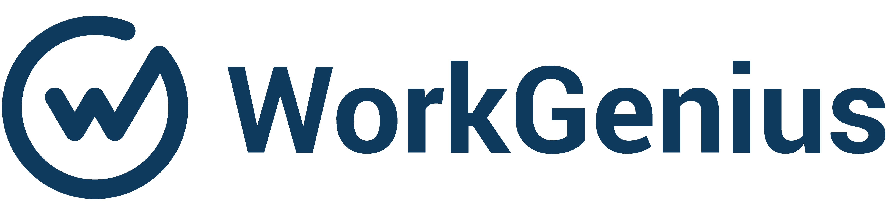

<h1 align="center">
  <br>
  <a href="https://www.workgenius.com/de/"></a>
</h1>

<h4 align="center">A minimal WebSocket Application that can handel <a href="https://mandrillapp.com/" target="_blank">Mandrill</a> Events.</h4>

<p align="center">
  <a href="https://github.com/amirbahador-hub/WorkGenius/actions/workflows/tests.yml/badge.svg">
    
  </a>
</p>

<p align="center">
  <a href="#key-features">Key Features</a> •
  <a href="#how-to-use">How To Use</a> •
  <a href="#download">Download</a> •
  <a href="#credits">Credits</a> •
  <a href="#related">Related</a> •
  <a href="#license">License</a>
</p>


## Project Setup


1. SetUp venv

    ```bash
    virtualenv venv
    source venv/bin/activate
    ```

2. install Dependencies
    ```bash
    pip install -r requirements.txt
    ```

3. spin off docker compose
    ```bash
    docker-compose -f docker-compose.dev.yml up -d
    ```

4. create your env
    ```bash
    cp .env.example .env
    ```

5. Create tables
    ```bash
    python manage.py migrate
    ```


6. run the project
    ```bash
    python manage.py runserver
    ```

7. for running the tests
    ```
    pytest . -rP
    ```

## Structure
